<h1 align="center"><span>Digit Recognizing </span></h1>


[](https://www.python.org/downloads/release/python-3116/)
[](https://git-scm.com/docs/git/2.39.0)

Digit recognition with YOLOv8 is an exceptional project designed to leverage the robust YOLOv8 object detection algorithm for recognizing digits in images or videos. Our repository offers an implementation of digit recognition using YOLOv8, comprising training scripts, pre-trained models, and inference tools.Als


# Digit Recognition

## Installation
Download the face detection repository:
``` shell
# Clone repo
git clone https://github.com/Yusuf-ozen/Digit_Recognizer.git
```

Navigate to the project directory:
``` shell
cd Digit_Recognizer
```


Install all necessary library:
``` shell
pip install -r requirements.txt
```


## Testing On Real-Time Webcam
Run this code at git bash or cmd:
``` shell
python yolo_live_test.py
```


## Testing on an Image
Run this code at git bash or cmd and change `/path/image` according your files. Using `--resize_width 400` and `--resize_height 400` the size of output image can change:


``` shell
python yolo_image_test.py /path/image.jpg --resize_width 400 --resize_height 300
```


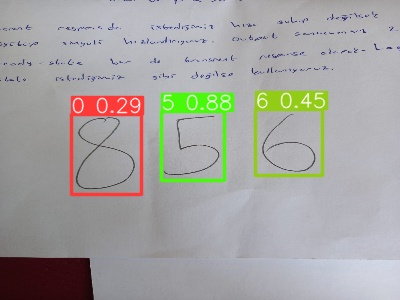


## Testing on a Video
Run this code at git bash or cmd and change `/path/image` according your files. Using `--resize_width 400` and `--resize_height 400` the size of output of the video can change:

``` shell
python yolo_video_test.py /path/video.mp4 --resize_width 1280 --resize_height 720
```


<br>
<div class="gif">
<p align="center">
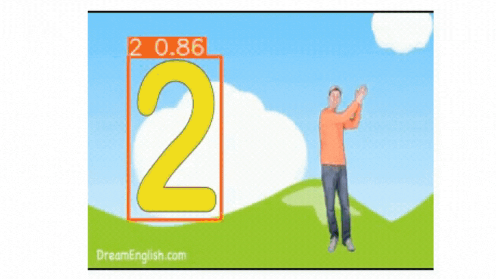
</p>
</div>
</div>


## Results
-This results produced after 50 epochs with yolov8s model and [Digit-Dataset](https://universe.roboflow.com/sambhavs-vision/number-extraction).


| F1 Curve | P Curve | PR Curve |
| :-: | :-: | :-: |
| 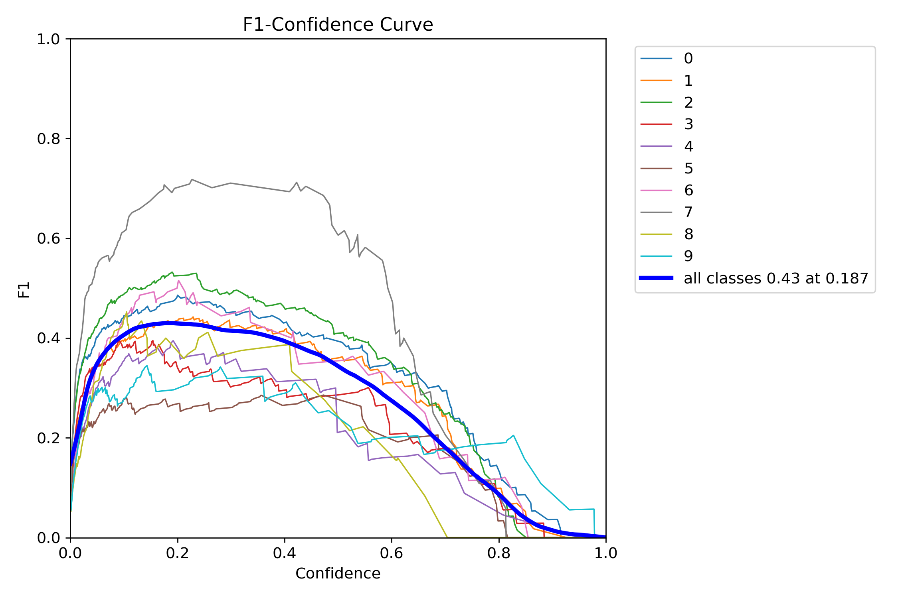 | 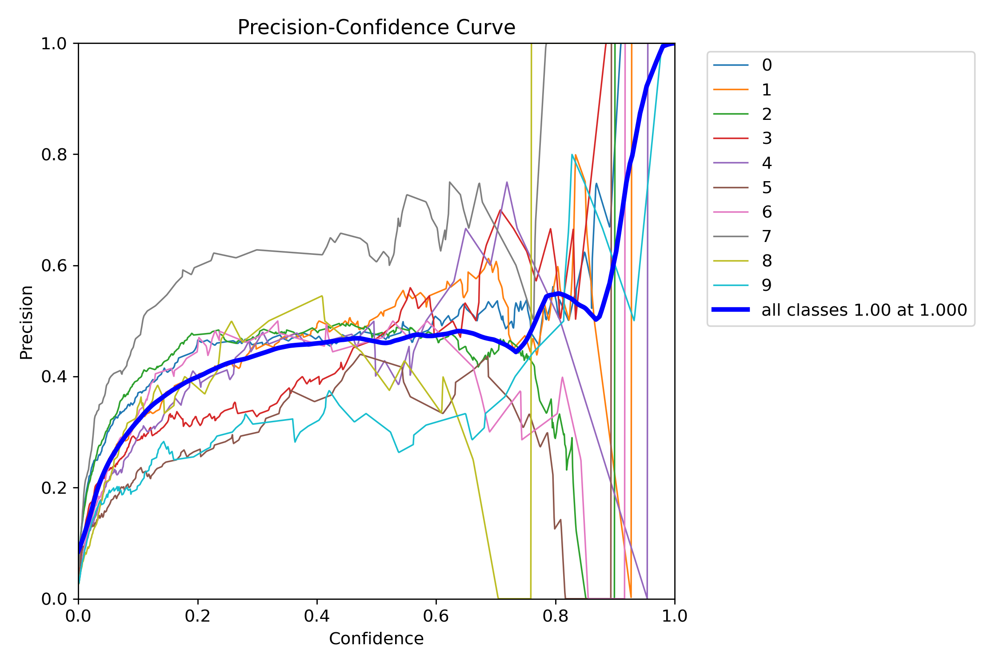 | 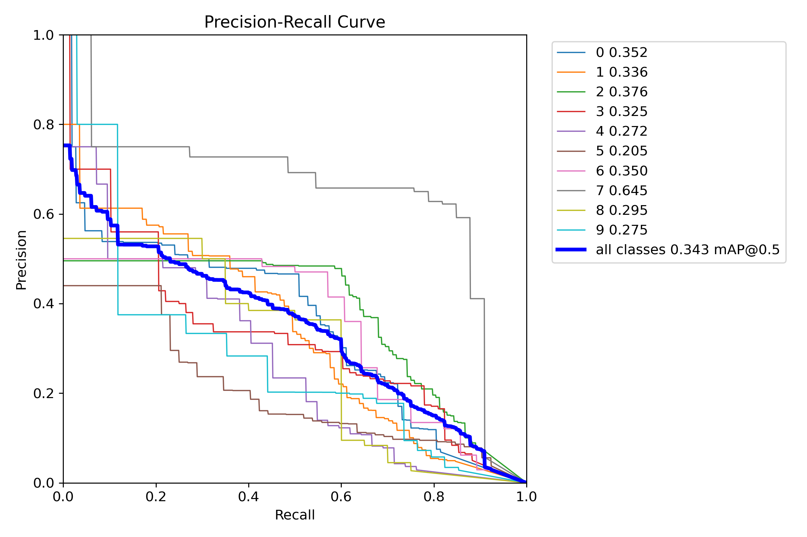 |

| Confusion Matrix | R Curve | results |
| :-: | :-: | :-: |
| 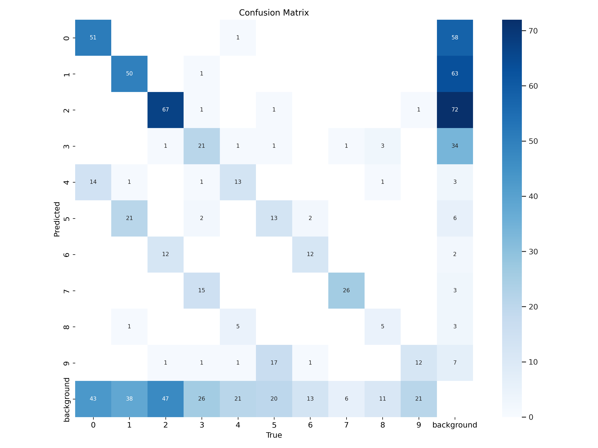 | 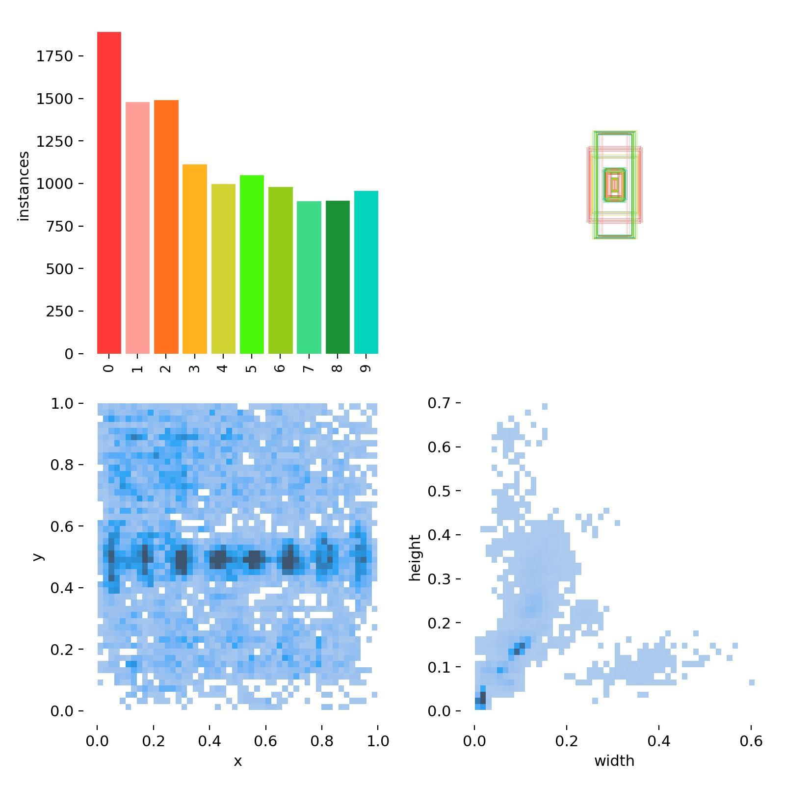 | 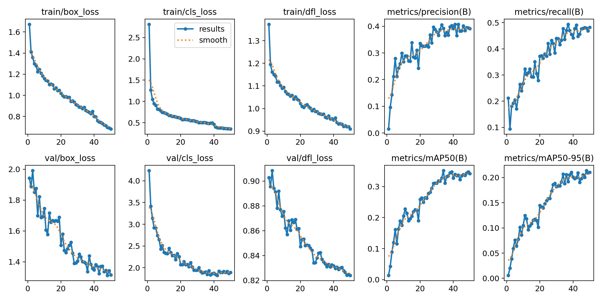 |


### Predictions

| label | Prediction | 
| :-: | :-: |
| 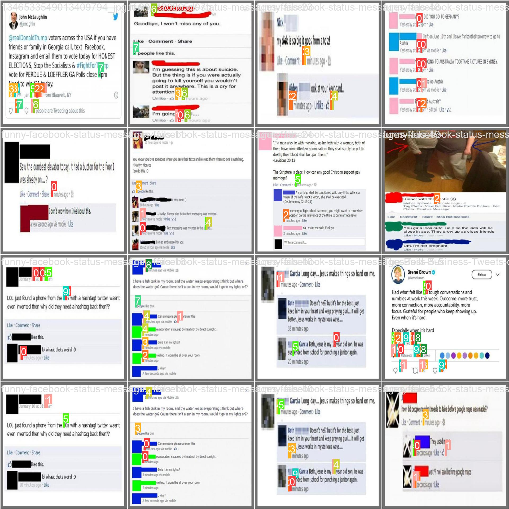 | 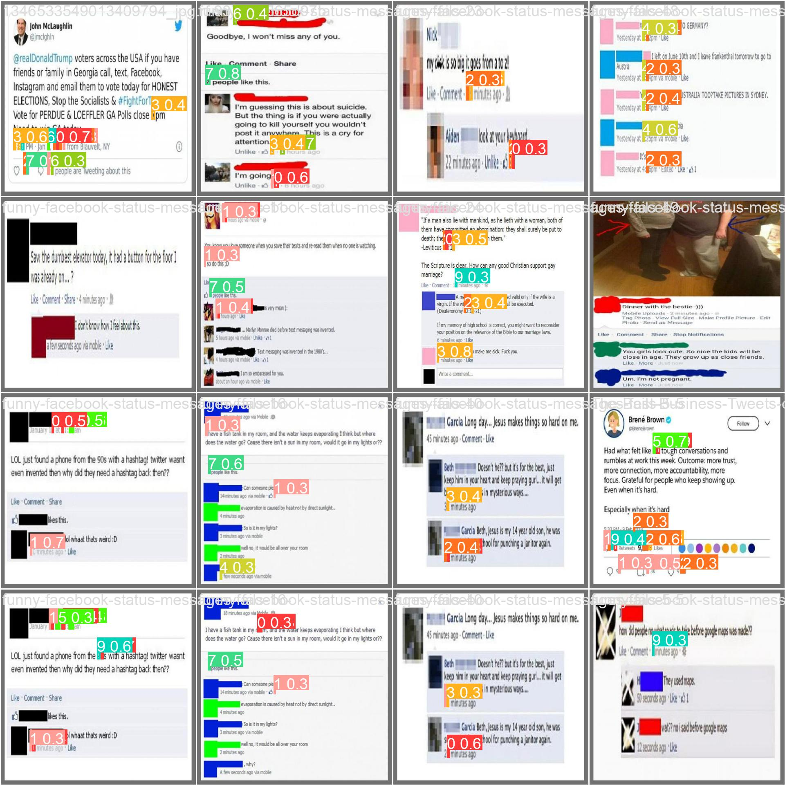 |


| label | Prediction | 
| :-: | :-: |
| 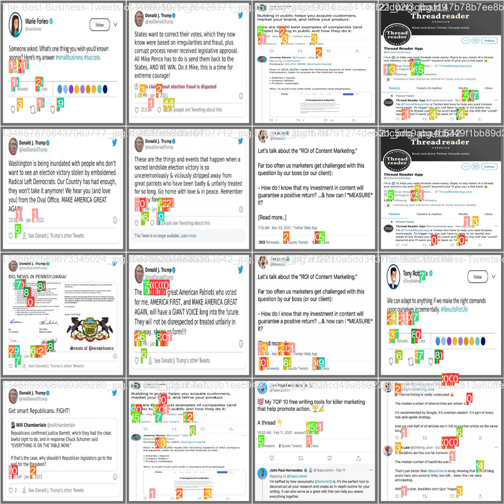 | 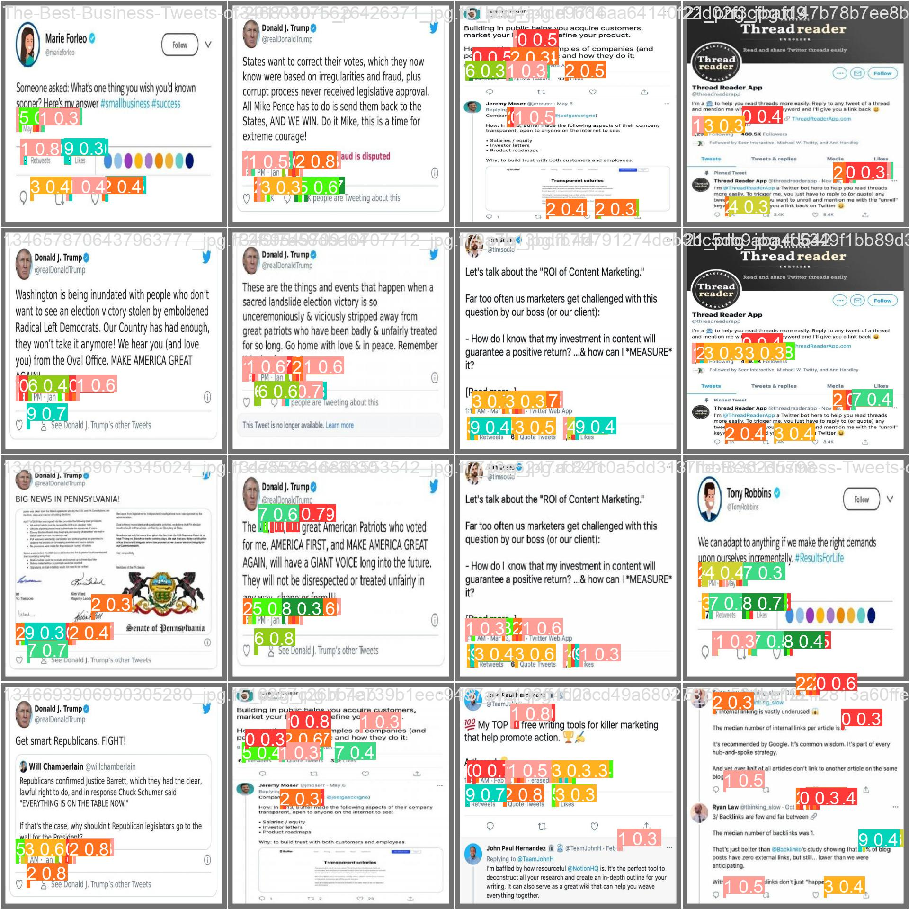 |


## Test Model with Streamlit
-Using Streamlit framework we can show the results of yolov8 model in web application.

### Usage

``` shell
streamlit run yolov8_main.py
```


### Image Testing

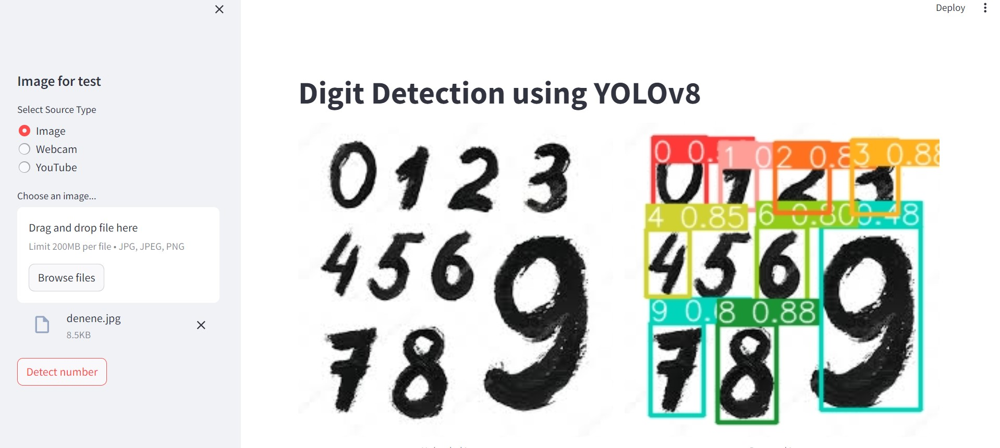


### My model Testing on mnist dataset

| test1 | test2 | 
| :-: | :-: |
| 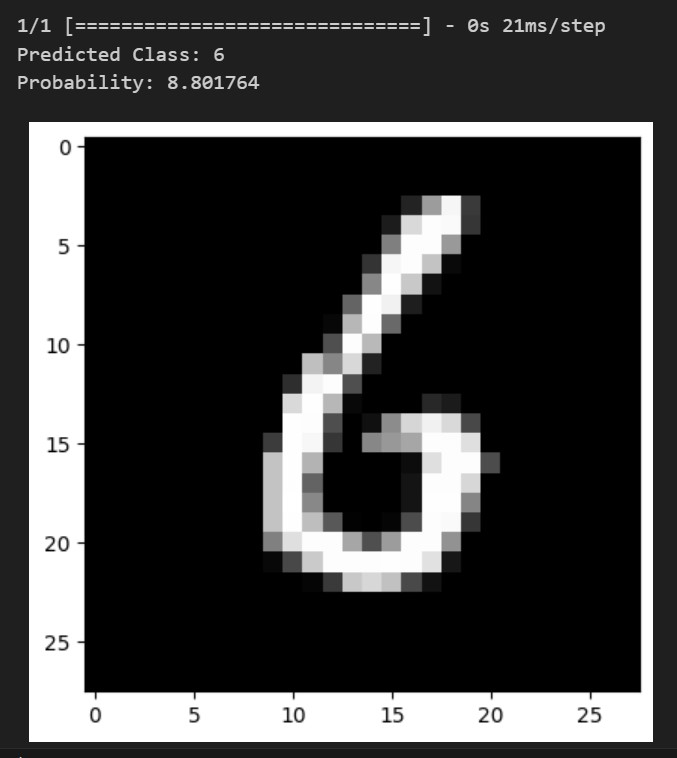 | 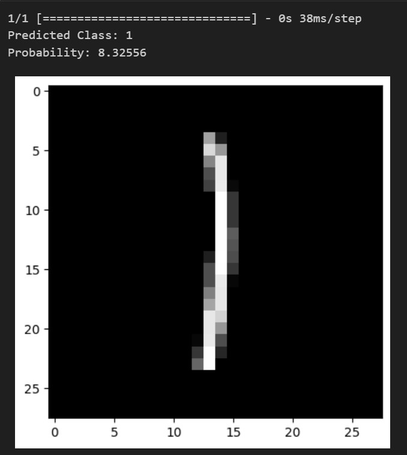 |


## References
https://roboflow.com/

https://github.com/ultralytics/ultralytics
